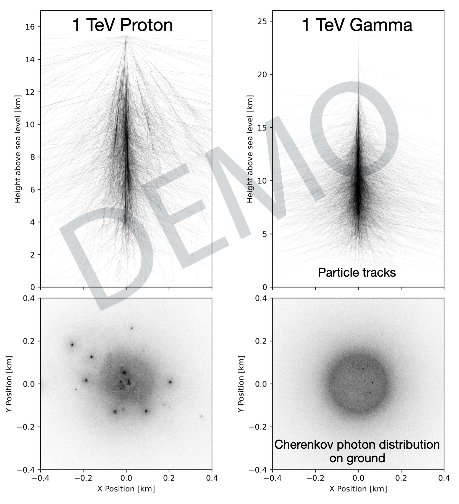

# Overview  

**ShowerPy** is a set of Python classes that provides users with a simple interface to create single-shower CORSIKA simulations, extract full particle track information, and generate shower plots.  
  

All data is available as pandas DataFrames, allowing you to create custom plots and perform detailed analysis. A quick overview of the workflow is shown below 


`
# Attribution 
The ShowerPy classes use [pyeventio](https://github.com/cta-observatory/pyeventio) and [pycorsikaio](https://github.com/cta-observatory/pycorsikaio) to load the fortran files produced by CORSIKA. Further, demo install on woodycap uses CORSIKA 7.8000 (Released February 2025). For more information visit the [official website](https://www.iap.kit.edu/corsika/99.php). 
You can also cite the showerpy releases using the [Zenodo DOI](https://zenodo.org/records/15340975).
# Getting Started  

First, create and activate the `showerpy` mamba environment using the following commands:
```shell 
mamba env create -f environment.yml
mamba activate showerpy
```
Then, open the demo notebook `Demo.ipynb`, which provides an introduction to using ShowerPy.

# Simulating Showers
As shown in the demo notebook, the `CorsikaRunner` class is used to generate the necessary simulations. If you’re running the demo on `woodycap5` or `woodycap6`, no additional setup is required, as the CORSIKA executable points to a public installation.

# Compiling CORSIKA 

If you want to simulate showers locally, please first [register as a new CORSIKA user](https://www.iap.kit.edu/corsika/79.php). After registering, you will receive login credentials to download CORSIKA. Once downloaded, unpack the archive using:

```shell
tar -xzf corsika*
```

## Installing Dependencies

To compile CORSIKA, you need to install [GFortran](https://fortran-lang.org/learn/os_setup/install_gfortran/) on your machine.

## Running the Configuration Tool

In the root of the extracted directory, run the following command:
```shell
./coconut -e
```
(The `-e` flag enters expert mode.)

You will then be prompted for different compile-time options. Select the following options in order, pressing *Enter* after each selection:

1. **Compiler Selection:** `2` (compiler default)
2. **High-Energy Hadronic Interaction Model:** `3` (QGSJETIII-01)<br>
**->** You can also switch to a different model depending on your use case. Please note that when using EPOS, a modification to the input_template is required.
3. **Low-Energy Hadronic Interaction Model:** `3` (URQMD 1.3cr)
4. **Detector Geometry:** `2` (non-flat volume detector geometry)
5. **Date and time routine:** `1` (automatic detection by configure)

## Enabling Additional CORSIKA Program Options

Next, you will arrive at the selection for additional CORSIKA program options. Please type the following string into the prompt:
```text
1b 8a 9a
```
These will configure the use of Konrad Bernlöhr's IACT routines (1b), the compilation of the PLOTSH script (8a), and the use of an external atmosphere profile (9a). 

You will then proceed to configure these options:

1. **Particles at detector level not stored in IACT file:** `1`
2. **Photons counted only in step where emitted:** `1`
3. **Emission angle depending on wavelength:** `2`

After this, press *Enter* to compile the `plottracks` script (`PLOTSH`). 

Then, press *Enter* again and confirm with `yes` to accept the selected CORSIKA program options.

**Please Note**:  
If you are re-running `coconut`, the settings used for the previous compilation are cached. You can automatically select them by pressing **Enter**.

## Compilation

Finally, to begin the compilation process select `f` and press *Enter* again. 

To test the successful compilation you can execute the binary `./run/corsika78000Darwin_QGSIII_urqmd`. If you are greeted with the CORSIKA message, everything has compiled successfully. 

## Atmospheric profile 
You will also need the atmospheric profile file `atmprof10.dat`. This file is available to [H.E.S.S. members](https://www.mpi-hd.mpg.de/hfm/~bernlohr/HESS/) and [CTA members](https://www.mpi-hd.mpg.de/hfm/CTA/MC/).